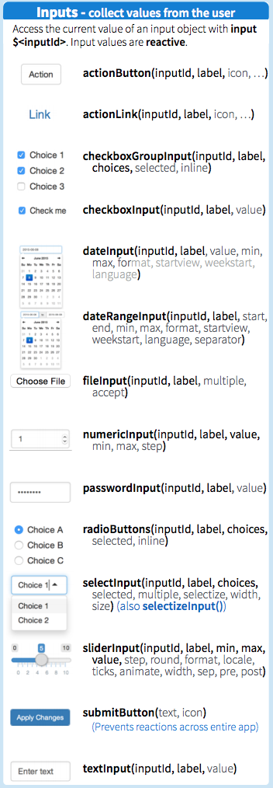
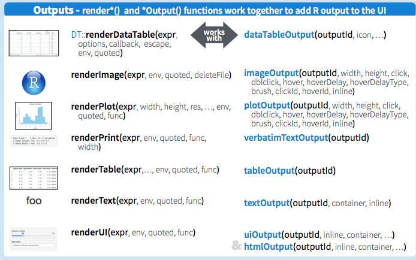

*8 minute read*  

This is a very brief introduction to building Shiny Apps in R.  

From RStudio:  

> Shiny is an R package that makes it easy to build interactive web apps straight from R. You can host standalone apps on a webpage or embed them in R Markdown documents or build dashboards. You can also extend your Shiny apps with CSS themes, htmlwidgets, and JavaScript actions.  


### Some examples  

1. [Shiny Gallery](https://shiny.rstudio.com/gallery/)  
2. [Leaflet](richpauloo.shinyapps.io/tds_leaflet)  
3. [Natural Language](richpauloo.shinyapps.io/abstr)  
4. [ggplots](richpauloo.shinyapps.io/word_cloud_app)  
5. [Plotly](richpauloo.shinyapps.io/ohi_viz)  

### A Shiny App is made of 2 functions  

* **User Interface** : What the user sees on a webpage  
    + out-of-the-box themes, with minimal need for HTML and CSS  
    + customizable if you want  
* **Server** : Takes inputs from the ui and computes outputs to send back to the ui  
    + if you're faimilar writing R code, making a server is not difficult  

### What does a Shiny App look like?  

A contained Shiny App contains a ui and server, and can be either:  

* a single file (app.R)  
* multiple files (ui.R, server.R)  
    + optional global.R : store data upload, data query, packages, custom functions  
    
### Run a Basic Shiny App Example from RStudio  
```{r}
#install.packages("shiny")
library(shiny)

#runExample("01_hello")
```


### Embed a Shiny App within a Markdown document  

[Help page](https://rmarkdown.rstudio.com/authoring_embedded_shiny.html)  

```{r, echo=FALSE}
shinyAppDir(
  appDir = "/Users/richpauloo/Desktop/shiny_workshop/min_ex",
  options = list(
    width = "100%", height = 800
  )
)
```


### Inputs  
[from RStudio](http://shiny.rstudio.com/images/shiny-cheatsheet.pdf)  



### Outputs  
[from RStudio](http://shiny.rstudio.com/images/shiny-cheatsheet.pdf)  



### Let's Build on our Example  

* add an interactive Data Table into the Old Faithful Shiny App example  
* add another column into the `faithful` data.frame called 'observer' with 4 observers  
    + then add a checkgroup group for observers to filter faithful by the observer, and plot the result (waiting v eruptions)  


### Hosting Your App  

You've built a Shiny App and it's time to host it. Here a few options:  

1. [shinyapps.io](http://www.shinyapps.io/) : Simple & Fast (free plans limited at 1GB memory)  
2. [Amazon Web Servers](https://towardsdatascience.com/how-to-host-a-r-shiny-app-on-aws-cloud-in-7-simple-steps-5595e7885722) : A little harder to configure (not free)  
3. [On a server you configure](http://www.kimberlycoffey.com/blog/2016/2/13/mlz90wjw0k76446xkg262prvjp0l8u) : You have serious time to kill  


# Additional Resources  

[RStudio videos](http://shiny.rstudio.com/tutorial/)  
[Shiny cheatsheet](http://shiny.rstudio.com/images/shiny-cheatsheet.pdf)  
